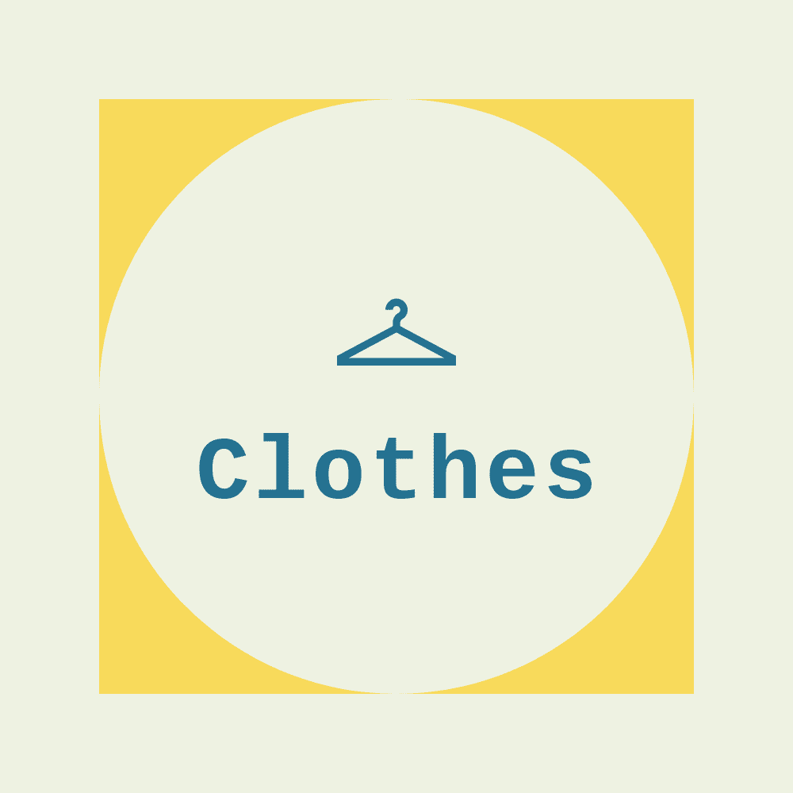

<!DOCTYPE html>
<html>

<body style="background-color: #B3DCBB ; ">

<head>
<link rel="stylesheet" href="styleethical.css">
<h1>Conscious Consumer</h1>
</head>

<meta name="viewport" content="width=device-width, initial-scale=1">

<a href="javascript:void(0)" class="closebtn" onclick="closeNav()">&times;</a>
<a text><b>What do we define as sustainable?</a></b>
<a text>We define sustainable as products/businesses that are organic, fair-trade, or locally sourced
    within the Southeast U.S.
</a>
 
 
 
<a href="https://www.usda.gov/topics/organic" target="_blank">  Click to learn more about organic</a>
<a href="https://www.fairtradecertified.org/" target="_blank">Click to learn more about fair trade</a>

<h2> &#9776; Why sustainable? </h2>

 

 
   

     

       

         
       

       

         <h3>Food</h3>
         
<a href=#breakfast>Breakfast</a>

         
<a href=#linner>Lunch/Dinner</a>

         
<a href=#dessert>Coffee/Dessert</a>

       

     

     

   

 

 
 

   

     

       
     

     

       <h3>Clothes</h3>
       
<a href=#used>Used</a>

     

     

   

 

 

<a name="breakfast">Breakfast</a>
 
<!-- THIS IS THE FIRST ONE -->
<meta name="viewport" content="width=device-width, initial-scale=1">

  
  

 

     <h2>Ye Olde Waffle Shoppe</h2>
     
http://www.yeoldewaffleshoppe.com/

     
 173 E Franklin Street Chapel Hill, NC 27514

     
Why it's sustainable: Ye Olde Waffle House is a restaurant that uses locally-sourced, organic ingredients. 

 

 

  

 

 

 <h4>Ye Olde Waffle Shoppe</h4>
 
 
 

 

<!-- THIS IS THE SECOND ONE -->
<meta name="viewport" content="width=device-width, initial-scale=1">

   <h2>Perennial</h2>
   
https://www.perennial.cafe/

   
 403 W Franklin St, Chapel Hill, NC 27516 

   
Why it's sustainable: Perennial is a restaurant that uses locally-sourced, organic ingredients. 

<h4>Perennial</h4>

 

 <a name="linner">Lunch/Dinner</a>
 
<!-- THIS IS THE THIRD ONE -->
<meta name="viewport" content="width=device-width, initial-scale=1">

   <h2>CholaNad Restaurant and Bar</h2>
   
http://cholanad.com/ 

   
 308 W Franklin St Chapel Hill, NC 27516 

   
Why it's sustainable: CholaNad is a restaurant that uses locally-sourced, organic ingredients. 

<h4>CholaNad Restaurant and Bar</h4>

 

<!-- THIS IS THE FOURTH ONE -->
<meta name="viewport" content="width=device-width, initial-scale=1">

   <h2>Top of the Hill Restaurant and Brewery</h2>
   
https://www.thetopofthehill.com/ 

   
 100 East Franklin Street Chapel Hill, NC 27514 

   
Why it's sustainable: Top of the Hill is a restaurant that uses locally-sourced, organic ingredients. 

<h4>Top of the Hill Restaurant and Brewery</h4>

 

<a name="dessert">Coffee/Dessert</a>
 

<!-- THIS IS THE FIFTH ONE -->
<meta name="viewport" content="width=device-width, initial-scale=1">

   <h2>Market Street Coffee & Ice Cream</h2>
   
http://marketstcoffee.com/#contact /

   
 Address: 227 S Elliott Road, Chapel Hill, NC 27514 

   
Why it's sustainable: Market Street Coffee and Ice Cream is a restaurant that uses locally-sourced, organic ingredients. 

<h4>Market Street Coffee & Ice Cream</h4>

 

<!-- SIXTH ONE, LAST ONE -->
<meta name="viewport" content="width=device-width, initial-scale=1">

   <h2>Open Eye Cafe</h2>
   
https://openeyecafe.com/

   
 Address: 101 S GREENSBORO ST, CARRBORO, NC 27510 

   
Why it's sustainable: Open Eye Cafe is a restaurant that uses locally-sourced, organic ingredients. 

<h4>Open Eye Cafe</h4>

 

<a name="used">Used Clothes</a>
 
<!-- LOL CLOTHES 1 -->
<meta name="viewport" content="width=device-width, initial-scale=1">

   <h2>Rumors</h2>
   
Website: facebook.com/rumorschapelhill

   
 Address: 106 North Graham Street Suite C Chapel Hill, North Carolina 

   
Why it's sustainable: Rumors sells gently-used clothing; making it an environmentally sustainable option for jazzing up your wardrobe.

<h4>Rumors</h4>

</body>
</html>
